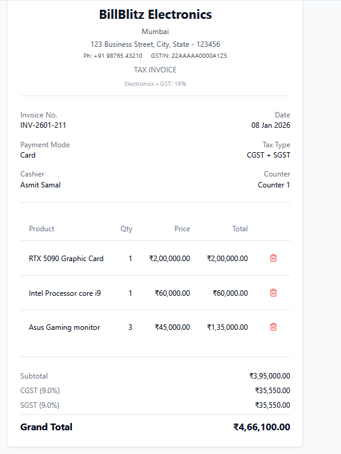
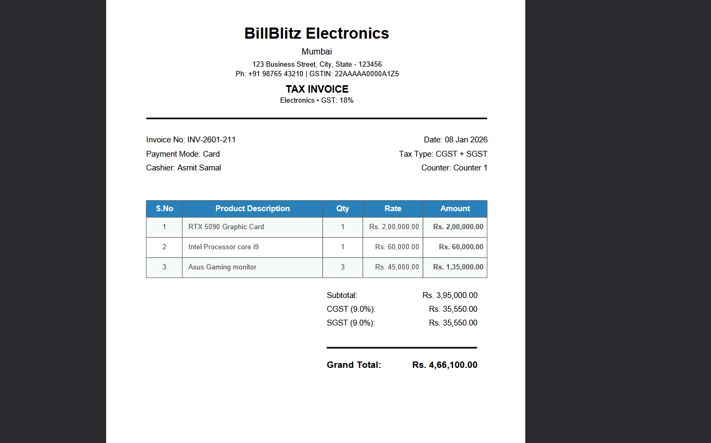

# 🚀 BillBlitz - Blitz Your Bills in Seconds!

**Professional GST Invoice Generator for Modern Businesses**

BillBlitz is a lightning-fast, professional invoice generator designed for malls, supermarkets, pharmacies, electronics stores, and small businesses. Generate GST-compliant invoices with dynamic tax calculations, custom business details, and instant PDF downloads.

---

## 🎯 Problem Solved

Traditional invoicing is slow, error-prone, and lacks flexibility. Small businesses struggle with:
- ❌ Manual GST calculations for different product categories
- ❌ Time-consuming invoice creation process
- ❌ Lack of professional invoice templates
- ❌ No support for different business types
- ❌ Complex software with steep learning curves

**BillBlitz solves all these problems with a simple, intuitive interface that generates professional invoices in seconds!**

---

## ✨ Standout Features

### 🎨 **Modern UI/UX**
- Clean, professional SaaS-style interface
- Responsive design for all devices
- Real-time invoice preview
- Smooth animations and loading states
- Celebratory confetti on successful PDF generation

### 🧮 **Smart GST Calculations**
- **Dynamic GST rates** based on business type:
  - 📊 **Electronics**: 18% GST
  - 💊 **Pharmacy**: 12% GST
  - 🏪 **General Store**: 0% GST
  - 💎 **Luxury Store**: 28% GST
- Automatic CGST/SGST split for intra-state sales
- IGST calculation for inter-state sales
- Real-time tax calculations

### 🏢 **Complete Business Details**
- Branch/Location information
- Full business address
- Contact number and GSTIN
- Cashier name and counter number
- Custom business name support

### 📄 **Professional PDF Generation**
- Clean, GST-compliant invoice format
- Proper formatting with Indian currency
- All business details included
- Professional layout and typography

### 🎮 **User Experience**
- Loading animations during PDF generation
- Success feedback with confetti animation
- One-click invoice reset
- Real-time preview updates
- Intuitive form validation

---

## 🏪 Business Flexibility

BillBlitz adapts to different business types with ease:

| Business Type | GST Rate | Use Cases |
|---------------|----------|-----------|
| **Electronics** | 18% | Mobile stores, computer shops, appliance stores |
| **Pharmacy** | 12% | Medical stores, drug stores, health centers |
| **General Store** | 0% | Grocery stores, convenience stores, daily needs |
| **Luxury Store** | 28% | Jewelry, premium goods, luxury items |
| **Custom** | Variable | Any business with custom name and details |

**Easy to extend**: Adding new business types with different GST rates is just a few lines of code!

---

## 🎮 How It Works

### 1. **Setup Business Details**
- Select your business type (Electronics, Pharmacy, etc.)
- Enter branch, address, contact details
- Add GSTIN, cashier name, and counter info

### 2. **Configure Invoice**
- Auto-generated invoice number
- Select payment mode (Cash, UPI, Card, Bank Transfer)
- Choose tax type (CGST+SGST or IGST)

### 3. **Add Products**
- Enter product name, quantity, and price
- Real-time calculation of line totals
- Easy product removal with one click

### 4. **Generate & Download**
- Live preview updates as you type
- Professional PDF generation with loading animation
- Instant download with success celebration
- GST-compliant format ready for business use

---

## 🚀 Tech Stack

### **Frontend**
- ⚛️ **React 18** - Modern React with hooks
- 🎨 **TypeScript** - Type-safe development
- 💨 **Tailwind CSS** - Utility-first styling
- 🎭 **Shadcn/UI** - Beautiful, accessible components
- ⚡ **Vite** - Lightning-fast build tool

### **PDF Generation**
- 📄 **jsPDF** - Client-side PDF generation
- 📊 **jsPDF-AutoTable** - Professional table layouts

### **State Management**
- 🪝 **React Hooks** - useState, useMemo for state
- 🔄 **Custom Hooks** - Reusable invoice logic

### **UI/UX**
- 🎨 **Lucide React** - Beautiful icons
- ✨ **Custom Animations** - Loading spinners, confetti
- 📱 **Responsive Design** - Works on all devices

---

## 📸 Screenshots





---

## 🔧 Quick Setup

### Prerequisites
- Node.js 18+ installed
- npm or yarn package manager

### Installation

```bash
# Clone the repository
git clone https://github.com/Asmit1211/BillBlitz.git

# Navigate to project directory
cd BillBlitz

# Install dependencies
npm install

# Start development server
npm run dev

# Build for production
npm run build
```

### Environment Setup
No environment variables required! BillBlitz works out of the box.

### Usage
1. Open `http://localhost:8080` in your browser
2. Fill in your business details
3. Add products to your invoice
4. Download professional PDF invoices instantly!

---

## 🎉 Hackathon Ready

### ✅ **All Requirements Met**
- ✅ Professional GST invoice generation
- ✅ Dynamic tax calculations
- ✅ Multiple business type support
- ✅ Custom business details
- ✅ PDF download functionality
- ✅ Responsive design
- ✅ Modern UI/UX

### ✅ **Multiple Custom Features**
- ✅ Real-time invoice preview
- ✅ Loading animations and success feedback
- ✅ Confetti celebration on PDF generation
- ✅ Custom business name support
- ✅ Professional invoice formatting
- ✅ Mobile-responsive design
- ✅ One-click reset functionality

### ✅ **Professional Presentation**
- ✅ Clean, modern interface
- ✅ Professional color scheme
- ✅ Consistent typography
- ✅ Smooth animations
- ✅ Intuitive user flow

### ✅ **Demo Screenshots Included**
- ✅ Dashboard overview
- ✅ Invoice preview
- ✅ PDF generation
- ✅ Mobile responsiveness

### ✅ **Clear Documentation**
- ✅ Comprehensive README
- ✅ Setup instructions
- ✅ Feature explanations
- ✅ Technical details
- ✅ Usage examples

---

## 🌟 Future Enhancements

- 🔐 User authentication and data persistence
- 📊 Invoice history and analytics
- 🎨 Custom invoice templates
- 📧 Email invoice functionality
- 🔗 Integration with payment gateways
- 📱 Mobile app version
- 🌐 Multi-language support

---

## 🤝 Contributing

Contributions are welcome! Please feel free to submit a Pull Request.

1. Fork the project
2. Create your feature branch (`git checkout -b feature/AmazingFeature`)
3. Commit your changes (`git commit -m 'Add some AmazingFeature'`)
4. Push to the branch (`git push origin feature/AmazingFeature`)
5. Open a Pull Request

---

## 📞 Support

If you have any questions or need support, please open an issue on GitHub or contact the developer.

---

**Built with ❤️ by [Asmit Samal](https://github.com/Asmit1211)**  
*Final Year BSc CS | Mumbai University*  
*MERN Stack Developer*

---

### 🏆 **BillBlitz - Making Professional Invoicing Accessible to Everyone!**

*Transform your business invoicing experience with BillBlitz - where speed meets professionalism.*